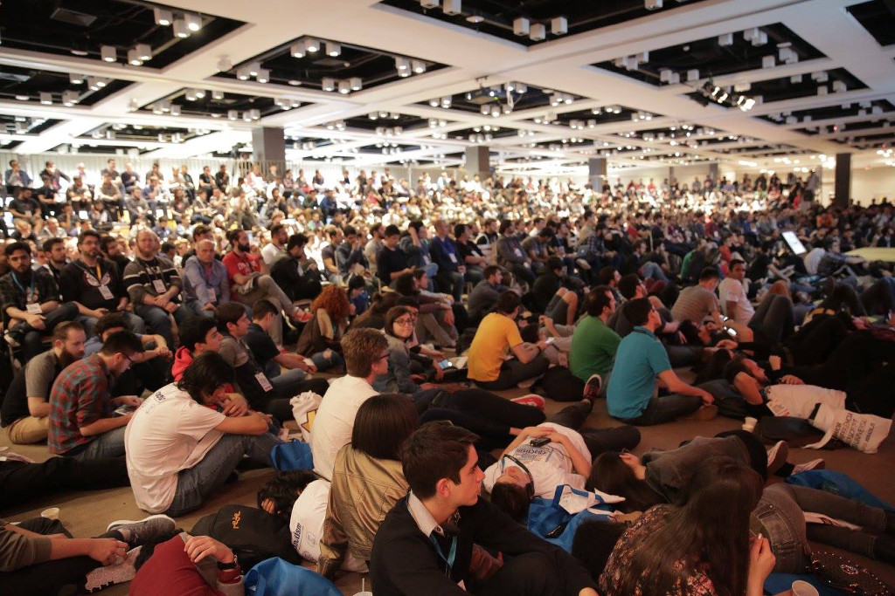

# Sugestões para a BrazilJS Conf

  

Seguindo uma sugestão incrível de alguns participantes da edição de 2016 (via pesquisa de satisfação), estamos abrindo para a comunidade a possibilidade de influenciar mais ativamente na organização do evento.  
Indique um conteúdo, palestrante, empresa ou qualquer outra sugestão para a BrazilJS Conf :)  

Veja como contribuir na seção [CONTRIBUTING](CONTRIBUTING.md)

Navegue pelas categorias para saber quais sugestões já foram feitas e estão sendo analisadas:  
- [Sugestões de palestrantes](https://github.com/braziljs/conf-suggestions/issues?q=is%3Aissue+is%3Aopen+label%3Aconf-speaker)  
- [Sugestões de conteúdo](https://github.com/braziljs/conf-suggestions/issues?q=is%3Aissue+is%3Aopen+label%3Aconf-content)  
- [Outros](https://github.com/braziljs/conf-suggestions/issues?q=is%3Aissue+is%3Aopen+label%3Aconf-other)